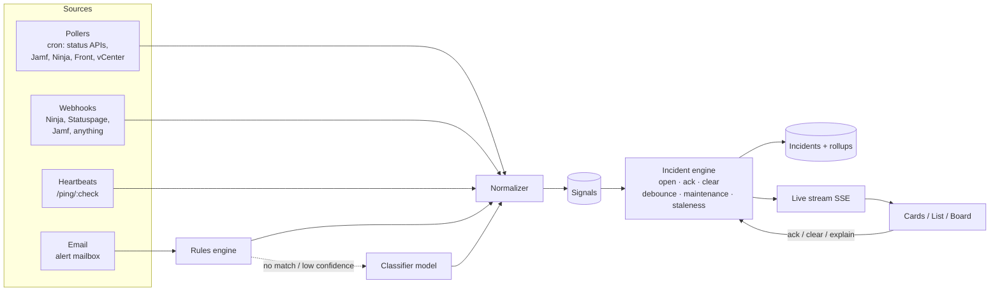

# IT Mission Control: design

A quick-look status board for everything IT depends on. It shows the **current state** of
each service, how long it has been in that state, and a compressed history, and it links
straight to the source for detail.

It fixes a specific problem. Alerts land in Slack and Front as one-off snapshots. You
can't tell what is still broken, or when something cleared, without lining up "FAILED"
and "RESOLVED" messages yourself. Mission Control keeps that state for you: it opens a
thing on alert, keeps it lit, and closes it when the clear arrives.

Prototype: [`prototype/index.html`](../prototype/index.html) (open it in a browser; it uses
simulated data and a scripted demo feed).

---

## 0. North Star

| | |
|---|---|
| **North Star** | Support organizational health. |
| **Strategy** | Surface signal and suppress noise. |
| **Purpose** | Give IT and system administrators clear, timely and actionable data: **in the moment**, **in retrospect**, and **for analysis**. |

Every view has to answer four questions:

1. What is the **current state** of our systems?
2. Are there any **current issues**?
3. Have there **been** any issues?
4. Do we need to **take action**?

**The test for any feature:** does it surface signal or suppress noise for one of those
questions? If it does neither, it doesn't ship.

### How the system answers today

| Question | In the moment | In retrospect | For analysis |
|---|---|---|---|
| Current state | Card border, master meter, board; platform page per part | History strip per check and per part | — |
| Current issues | Needs attention, card text with vendor reference, Log → Open | Incident timeline (vendor posts, our notes) | — |
| Been any issues? | PEAK hold (30 min), recent-changes ticker | Log (tracked, archived, all), Markdown export | 90-day records; archived kept permanently |
| Take action? | Colors and severity order; snooze for "seen, working on it" | Notes on the timeline | — |

**Surfacing signal:** vendor feeds and our own systems in one place; **reported issues**
for problems a vendor hasn't acknowledged (Sway); vendor references and impact text on the
card; per-part state on platforms; peak hold; tracked incidents.

**Suppressing noise:** attack fast and release slow; false alarms (closed, repainted,
key suppressed); park (known and deferred); snooze (time-boxed); **parts marked not used**
(Teams); ignored and parked items kept out of counts, flashes and the default Open list,
but still recorded. Suppressed never means deleted: everything stays answerable in
retrospect.

### Two lanes, and a sister product

- **Status** (this board): is it working? Red, yellow, green, with incidents.
- **Workload** (next): what's open and outstanding? A basic **snapshot** per system, never
  a replacement for its own reporting. Each snapshot card shows three numbers, their
  change since the last poll, and a link to the system's report. It turns yellow or red only
  when a threshold is crossed. Proposed numbers, most actionable first:
  - **Tickets (Front):**
    - **stale** (open longer than X days) with the oldest one's age: someone needs to follow
      up.
    - **opened in the last hour** compared with the usual for that hour: a surge is often the
      first sign of an outage, and can suggest a reported issue.
    - **open now**, as context.
  - **Devices (Jamf, NinjaOne):**
    - **checked in within 24h, as % of managed**. A sudden drop is a *status* signal, e.g. an
      expired APNs certificate or a broken agent, so it can light the platform card.
    - **not seen in 30 days**: a cleanup list.
    - **compliance failures** with the top reason (encryption off, OS out of date, endpoint
      protection missing).
    - **total managed**, as context.
  These need only API reads and thresholds. The JSON driver's rules already cover the
  threshold part; a small "snapshot" card type is the new piece.
- **Insights** (sister product, same data): metrics and reporting. Availability per service
  and part, time to resolve, incident counts and trends, the noise ledger, and workload
  trends. Read-only, its own page, built on the stored incident records and history. It's
  deliberately lighter than a full BI tool: a fixed set of answers to the four questions
  "for analysis", not a query builder.

### Gaps against the North Star (next work, in priority order)

1. **"Do we need to take action?" is implicit.** Color says how bad, not whose move it is.
   Proposal: every counted incident carries an **action state**: *Ours* (we need to do
   something), *Vendor's* (wait and communicate), or *None* (informational). Plus an
   optional owner and next step. The board's attention zone sorts by "Ours" first. This is
   the biggest remaining step toward "actionable".
2. **Analysis has records but no reports.** Add a Reports view: availability per service
   and per part (from history spans), incident count and time to resolve, and a **noise
   ledger** per source (false alarms, ignored, parked, flapping). The ledger shows which
   alert rules to tune. The daily and weekly digest (section 5) draws on the same numbers.
3. **Timeliness of core platforms.** Hourly polling is the default. For platforms people use
   all day (Microsoft 365, Google Workspace), 10–15 minutes is the better trade.
4. **People see problems first.** Sway was confirmed by users before Microsoft posted
   anything. A spike of help-desk tickets (Front) or user reports mentioning a service
   should **suggest** a report, for one click to confirm.

---

## 1. Design principles

Taken from game HUDs, watch complications, mixing desks, and the classic Windows Task
Manager ("TMOG"):

1. **Every pixel has a job.** A card shows five things and nothing else: brand icon, name,
   current state (the border), time in state, and history. Everything else lives one click
   away in the side panel.
2. **Healthy is quiet, trouble is loud.** Green borders are dimmed so a wall of healthy
   services recedes. Only off-nominal states use full color, glow or motion. On a TV, motion
   is reserved for DOWN so the eye goes straight to it.
3. **The border is the state; the strip is the past.** The outline of a card (or the name
   pill in list view) is always the *current* state. The history strip never decides the
   border color.
4. **Peak and hold, like a clip LED.** When a check goes red, the border flashes, then stays
   red until it clears. After it clears, a fading **PEAK** tag and corner notch stay for
   30 minutes. Someone glancing at the TV can tell that something just happened, even if
   it has already recovered.
5. **Attack and release.** As on an audio compressor, entering a bad state is fast and
   leaving it is deliberate. A check needs N consecutive good readings to clear, which
   stops a flapping check from strobing the board.
6. **State is never color alone.** Each state has a glyph (◆ ▲ ○ ■ ◇ ●) and a word, so the
   board stays readable for colorblind viewers and on washed-out TVs.
7. **Springboard, not a destination.** The side panel always leads with "Open source ↗".
   Mission Control tells you *where to look*; the vendor, Jamf, Ninja or Front is where you
   act.

## 2. States

| State | Color | Glyph | Meaning | Enters when | Leaves when |
|---|---|---|---|---|---|
| **DOWN** | red | ◆ | Hard failure or major outage | Source reports major/critical, a job fails, or heartbeats are missed past the hard limit | A clear signal, then the release window passes |
| **DEGRADED** | yellow | ▲ | Partial outage, threshold breach, alerting | Minor incident, metric over threshold | Same as above |
| **SNOOZED** | orange | ■ | A signed-in person has seen it and silenced it for a set time. It is still not fixed. | Someone snoozes a DOWN, DEGRADED or NO SIGNAL for 15m, 1h or 4h | The signal clears, the snooze runs out, or it gets worse |
| **NO SIGNAL** | grey, dashed | ○ | We don't know. Data is stale or the source is unreachable | No poll, ping or mail inside the expected interval × grace | Any fresh signal |
| **MAINTENANCE** | blue | ◇ | Expected downtime | A maintenance window is active (vendor-scheduled or ours) | Window ends |
| **OPERATIONAL** | green (dim) | ● | All good | A clear signal | — |

Rules:

- **Severity order** (sorting and history aggregation): DOWN > DEGRADED > NO SIGNAL > SNOOZED > MAINT > OK. Parked checks sort after all of them.
- **Snoozes belong to the incident, not the check.** A snooze needs a signed-in user and is
  always time-boxed. If it runs out while the issue is still open, the check re-arms to its
  previous state and flashes again. It also re-arms early if the snoozed incident gets
  worse (DEGRADED to DOWN) or a new incident opens. The card counts down the time left
  ("2h 47m left"). Finer rules (who can snooze what, maximum length, notes required) are
  still to be designed.
- **Unexpected statuses** (a value the adapter doesn't recognize, or a classifier result
  below the confidence threshold) show orange with a "needs review" tag. That keeps them
  visible without claiming an outage.
- **NO SIGNAL stays grey** (decided). "We can't see it" is a different problem from "it's
  broken" and needs a different fix.
- **Explained history turns blue.** After an outage, someone (or the vendor's postmortem
  feed) can mark the incident as explained or planned. Its history cells repaint blue. The
  border is unaffected because that outage is over.

### Noise controls: false alarms and parked checks

Not every alert deserves a light. There are two tools, and they do different jobs:

| | **False alarm** | **Park** |
|---|---|---|
| Use for | This alert was wrong | This is real, but it can wait (the AP that keeps dropping with no user impact) |
| Effect now | Closes the incident, with no PEAK hold | The check leaves "Needs attention", stops flashing, isn't counted in the header and never reorders the board |
| History | The alert chain repaints as **× false alarm** (dim grey) and is left out of availability figures | Keeps recording the real state, so you can still see the flapping |
| Card | Normal | Dashed neutral border, a **PARKED** tag next to the underlying state, the reason and the "until" date, in a **Parked** tray at the bottom |
| Ends | — | On its review date (it comes back lit if it is still bad), when someone unparks it, or through an escalation guard (e.g. DOWN for more than 4h, or more than N sibling APs affected) |
| Feeds | Rules and classifier: a negative example and a suggestion to tighten or suppress the rule | The weekly digest: "parked items past their date" |

Both actions need a signed-in user, record who did it and why, and appear in the signal
log.

### Platforms, parts and relevance

A broad service like **Microsoft 365** or **Google Workspace** is a **platform**: one
card on the board, plus its own page with a card per **part** (Exchange Online, SharePoint
Online, Sway, Teams…). Each part has its own state, current issue and history strip.

- **Parts come from the source** (Microsoft's service name, Statuspage components, Google
  products) or are listed in the connector file. Parts seen in incidents are added
  automatically.
- On the main board, a platform card shows a **strip of small lights, one per part**, with
  the affected parts named ("SharePoint Online · Sway"), so you can tell which part is down
  without opening anything.
- **Mark a part "not used"** (e.g. *Microsoft Teams: we don't use Teams*). An incident that
  touches **only** parts marked not used is recorded and visible under Log → Ignored, but it
  never lights the card, the board or the counts. An incident that also touches a part we
  use still counts. The change applies to open incidents immediately, can be undone, and
  is logged with who made it. It needs connector rights, because it's a standing decision
  about what we run.

### Reported issues (manual entries)

Some problems are confirmed before any source shows them. For example: **Sway** lets users
sign in and edit, but not every change saves, and a refresh drops the unsaved work.
Microsoft has posted nothing. Anyone with operate rights can **Report issue** on a check or
on one part of a platform: how bad, what's happening, details, an optional reference.

- A report lights the card like any other issue, marked **REPORTED**, with a full
  timeline.
- Vendor polls that don't mention it **don't clear it**. A person **resolves** it, and the
  text in the note box becomes the resolution.
- It counts **even on a part marked not used**: someone saw it affect us.
- For systems nothing else watches, the `manual` driver makes a check whose state comes
  only from reports.

### Incidents as records: track and archive

The card answers "is it broken now?". The **incident** answers "what happened, and what did
we do?". Every issue a source reports becomes an incident record with:

- the **vendor's reference** where there is one, e.g. **SP1489449** (Microsoft 365,
  SharePoint Online, "Some users are not able to see apps", a service degradation, so
  **yellow**). The reference leads the card text and is searchable.
- the vendor's **impact statement** and **start time**, kept separate from when we
  **detected** it. Durations count from the vendor's start when known.
- a **timeline**: each vendor post (recorded once, however many polls see it), detection,
  state changes, snooze, park, **notes** from your team, close or reopen.

Actions on an incident:

| Action | When | Effect |
|---|---|---|
| **Track** | Open incidents | Follow it: a ◎ SP1489449 chip on the card, a TRACKED badge in the log. **Archived automatically when it closes.** |
| **Archive** | Closed incidents | Keep the record permanently. Untracked, unarchived records are purged after **90 days**. |
| **Add note** | Any | Who you told, what you saw, what you did. |
| **Copy as Markdown / Download .md** | Any | A clean record for a ticket, a postmortem or a Slack thread. |
| **Check now** | Polled checks | Ask the source immediately instead of waiting for the next poll, e.g. to confirm a fix. |

If the same vendor incident disappears and comes back within 6 hours, it **reopens the
same record** instead of starting a new one. The **Log** view lists every incident with
Open / Tracked / Archived / All filters and a search box (by reference, service or text).
Incidents follow their check's visibility rules exactly. MCP has `list_incidents` and
`get_incident`, so an assistant can summarize or draft a postmortem from the record.

## 3. The compressed-time history strip

Task Manager's scrolling graph, folded so the recent past gets the most room. The strip is
cut into four zones. Each zone holds more time per cell than the one to its right:

```
|  4w → 7d   |   7d → 24h   |   24h → 1h    |      last hour       | now
|  3 × week  |   6 × day    |  23 × hour    | 30 × 2 min (cards)   |
|            |              |               | 60 × 1 min (list)    |
```

- **Cell color** is the worst state in that bucket (severity order above, with explained
  incidents counted as MAINT).
- **Cell brightness** is the share of the bucket that was affected. A 10-minute blip in a
  one-week cell is a dim sliver; a day-long outage is fully lit. Coarse buckets stay honest
  this way, because a single bad minute doesn't paint a whole week red.
- Healthy cells are drawn at ~20% green, so trouble stands out.
- "Not yet monitored" is drawn as empty track, which is different from healthy.
- Hovering a cell shows its time range, state and share affected.

Storage follows the same shape: raw signals are kept for 48h, then rolled into hourly
buckets for 30 days, then daily buckets for a year. That makes the strip cheap to render
for 100+ checks.

## 4. Views

| View | For | Notes |
|---|---|---|
| **Cards** | Desk use | Grouped by Public SaaS / Our platforms / Infrastructure. With **Auto-focus** on, anything needing attention rises into a "Needs attention" section, followed by "Planned". Healthy groups sort recently-recovered first, so PEAK tags stay near the top. |
| **List** | Density, triage | One row per check. The status color sits on the name pill. Wider history (1-minute cells for the last hour). On narrow screens, rows stack. |
| **Board** | TV / NOC wall | Designed to fit **1920×1080** with no scrolling (verified for about 18 checks; past about 40 it needs group roll-ups). No controls to fiddle with. Attention items are big; healthy checks collapse to small tiles with a mini history. A "recent changes" ticker along the bottom answers "did that clear?" ("14:02 Slack ● OK after 9m"). Requests a screen wake lock; `F` toggles fullscreen. |
| **Side panel** | Click any card or row | Current state, **Open source ↗**, snooze, false alarm, park, clear, check now, signal facts (source, interval, last heard), the check's **incidents** (open ones and recent closed), a full-width history strip, and the raw signal log. Clicking an incident shows its record and timeline in the same panel. |
| **Log** | Follow-up, reporting | Every incident: open, tracked, archived or all, with search. Rows show state, vendor reference, title, service, when it was detected and how long it lasted. |

**Card sizes (auto-focus):** attention gets room, and quiet services get out of the way.

| Size | Shows | When |
|---|---|---|
| **Full** | Everything: logo, name, state, duration, message, parts strip, history, freshness | Anything that needs attention, is in maintenance, or is in its 30-minute peak hold. **Always**, whatever size was chosen. |
| **Small** (about ¼ card) | Logo, name, small history strip, "up 11d", 28-day uptime % | Operational for **7 days straight** (auto), or chosen |
| **Logo only** | The logo in a **Minimized** tray, with a status border | Chosen, to mostly hide a service and keep one-click access |

The size is chosen per service in its panel (Auto · Full · Small · Logo only), saved on the
server, and applies for everyone. The **Size** control in the header sets density for this
screen:
- **Auto:** 8 services or fewer stay full; up to 30, quiet services shrink after 7 days;
  more than 30, after 1 day.
- **Roomy:** never shrink automatically.
- **Dense:** every operational service is small.

Cards with sample data say **demo** after the name (a `demo: true` connector, and every
card in the prototype), so nobody mistakes them for real.

**Themes:** dark is the default and suits a TV. Light mode puts a **solid status banner
behind each service name**, because thin colored borders wash out on white. Healthy checks
get only a faint tint, so trouble still stands out. Status text darkens in light mode to
stay readable. Auto follows the OS; the header toggle overrides it per browser.

**Header master meter:** one LED segment per check, sorted by severity, plus counts per
state. It works like the master bus on a mixing desk: the whole estate in one glance,
readable from across the room.

**Auto-focus (stage 2):** the prototype already reorders by severity, then by recency, and
animates the moves so they read as movement rather than a jump. The production version adds:

- A **reorder cooldown** on the TV (e.g. at most once every 30s) so the layout doesn't
  churn.
- **Pins** for checks that should always hold their position.
- Weighting by **business impact** (e.g. Okta DOWN outranks a GitHub DEGRADED).

### The TV board: everything on one screen

A wall screen can't be scrolled, so the Board view **fits the screen** instead of flowing
down it. It's one packed grid of three card sizes: **full** (4×4 cells), **quarter** (2×2)
and **1/16** (1×1: logo, name, status dot). Smaller cards fill the gaps left by bigger ones.

1. **Attention first, full size, at the top:** down, degraded, no signal, snoozed, or within
   30 minutes of recovering. Planned maintenance gets a quarter card.
2. **Calm services fill the rest, by importance.** Each connector has a `criticality`
   (high / normal / low). High stays full size even when green; normal shrinks to a quarter
   card after 7 quiet days; low goes to quarter, then 1/16. A size chosen in the panel is
   respected.
3. **If it doesn't fit, the least important shrink first:** full → quarter → 1/16. Highs are
   last to shrink.
4. **If even 1/16 cells don't fit, the smallest calm services rotate** through pages every 8
   seconds, like a departures board ("Quiet services · page 2 of 3"). Attention never
   rotates.
5. **A wide outage** (attention would take more than ~60% of the screen) drops attention
   cards to quarter size, so more problems are visible at once. If problems alone still
   overflow, the screen scrolls; that's the one case where seeing everything wins over
   fitting.

The fit is computed from the real screen size and checked after drawing. At 1920×1080 the
demo's 17 services fit with no paging.

### Boards and sharing

A **board** is a named view, e.g. *IT board* or *IR board* (institutional research): a set
of groups and/or services. Everyone switches boards from the header, and every view (cards,
list, board, counts) shows only that board's services. An instance starts with an *IT
board* showing everything.

**Share board** puts the board you're looking at on a screen:

1. A signed-in admin opens the board and chooses **Share board**, names the **screen**
   ("Lobby TV") and creates a one-time code (`5TM-9XX`, 10-minute expiry, no ambiguous
   characters). The box has a × and closes on Escape, an outside click or a view change.
2. **Sharing not allowed** if the board includes any **private** service (sensitivity
   `sensitive` or `secret`). The box says so and names those services, but only to someone
   who can see them. Make a board without them to share it.
3. The screen opens `/pair`. Unpaired, it shows only a code entry box and no status data.
4. A matching code is **spent on first use** and becomes a **screen token**, stored hashed
   and valid for **30 days**. The screen sees staff-level services, **but only its board's**,
   in every channel: checks, incidents and the live stream. A screen whose board is deleted
   shows nothing. The admin's box closes on its own ("Lobby TV paired. That code no longer
   works."). Screens are read-only.
5. **Active screens** lists each screen with its board ("Lobby TV · IT board").
   - **Expiry without re-pairing:** an expired screen shows "Board access expired"; in the
     list it reads "Expired Oct 4" with **Reauthorize**, which extends the same token by 30
     days. The screen reconnects within a minute.
   - Screens within 7 days of expiry show **Reauthorize** too.
   - The **Share board** button turns yellow when a screen expires within 7 days, and red
     when one has expired.
6. Revoke removes a screen immediately. A board that screens still show can't be deleted.
   Redeeming codes is rate-limited per address.

Typing on a TV remote is clumsy, so we can add the reverse flow later: the TV shows the code
and the admin types it on their laptop. The same token model supports both.

**TV hygiene:** a dark ground, a dimmed healthy state and a slow pixel shift protect
OLED/plasma panels from burn-in. Minimum type size is set for reading at about 3 m.

## 5. Architecture



### Core model

- **Check**: something that has a state. `id, name, group, icon, source_url, adapter,
  expected_interval, grace, release_count, impact`.
- **Signal**: an immutable observation. `check_id, observed_at, state, summary,
  correlation_key, origin, raw, confidence`.
- **Incident**: an open-to-closed span for one `(check_id, correlation_key)`. It records
  open, worst, ack (who, note), clear (by signal or by hand) and explanation. **Current
  check state = the worst open incident**, overridden by an active maintenance window, or
  NO SIGNAL when stale.
- **Maintenance window**: from vendor feeds (Statuspage "scheduled" incidents, M365 planned
  maintenance) or entered by us.

A check can have several open incidents at once. NinjaOne might report "disk 92%" and
"service stopped" on FS01; the card shows the worst, and the panel lists both.

### Ingest adapters

**Cadence defaults:** proactive polls run **hourly** by default, and every few hours for
slow-moving checks such as certificate expiry and license counts. Each check sets its own
interval. A polled check that isn't operational **speeds up to every 5 minutes** until it
clears (the card shows `poll 5m ▴`), so recovery is caught fast without hammering APIs the
rest of the time. Push sources (webhooks, heartbeats, email, Slack) arrive when they arrive.
NO SIGNAL only applies where an interval is expected (2× interval grace by default). We will
tune all of this during testing.

| Kind | Examples | Notes |
|---|---|---|
| **Poll** | Statuspage-hosted status pages (Zoom, GitHub, Atlassian and many others expose `/api/v2/summary.json`), Slack's status API, Microsoft Graph service health (`admin/serviceAnnouncement/healthOverviews` and `/issues`, needs `ServiceHealth.Read.All`), Google Workspace status JSON, Jamf Pro (`/healthCheck.html` plus API checks), NinjaOne API (device and alert state), Front API (queue snapshot: open count, past-SLA count, oldest), vCenter REST (hosts, triggered alarms) | Each adapter maps vendor states onto our six. Cadence is per check. **Endpoints to be confirmed against each vendor's current docs during build.** |
| **Webhook** | NinjaOne alert webhooks, Statuspage subscriptions, Jamf webhooks, generic JSON | `POST /api/ingest/:source` with a per-source secret or HMAC. A generic schema lets anything that can send JSON report state. |
| **Heartbeat** | Cron jobs, backup scripts, Linux and Windows boxes | `GET/POST /api/ping/:check/:token` (and `/fail`). A missed ping moves the check to NO SIGNAL, then to DOWN past a hard limit. Same idea as healthchecks.io. |
| **Slack channel** | `#it-alerts`, `#it-network-alerts`, vendor bots posting into Slack | Slack Events API (a bot added to the alert channels). Messages go through the same rules → classifier pipeline as email, and thread replies count as follow-ups. This is likely the **first** text source, since most alerts already land in Slack. |
| **Email** | Veeam, UPS, vendor notices, anything that only emails | An alert mailbox (an M365 shared mailbox read through Graph, or forwarding into an inbound-mail endpoint). See below. |

For Windows and Linux servers, the plan is to **lean on NinjaOne** (it already watches them)
rather than run a second agent. Heartbeats cover the gaps (cron jobs, appliances, things
Ninja can't see).

### Email: open on alert, close on follow-up

1. **Parse**: sender, subject, body, thread headers (`Message-ID`, `In-Reply-To`,
   `References`).
2. **Tier 0, deterministic rules** (most mail): sender and subject patterns map to
   `check`, `state` and `correlation_key`, plus whether the mail *opens* or *clears*. For
   example:
   `from:veeam@ subject:/\[(Failed|Warning|Success)\] (?<job>.+?) / → check=veeam-{job}, key={job}, Success ⇒ clear`.
   Thread headers and normalized subjects (with `RE:`, `[RESOLVED]` and similar stripped)
   tie a resolution to the alert it closes.
3. **Tier 1, "System 1" classifier** (anything rules don't match): a small, fast model
   that makes a quick call on a single message. It doesn't reason over the whole system.
   It reads the message and returns structured JSON:
   `{check_id | "unknown", state, correlation_key, opens|clears, confidence, one_line_summary}`.
   - Confidence at or above the threshold: it acts, and the log shows
     `classified by model (0.91)`.
   - Below the threshold, or an unknown check: an orange **needs review** item holding the
     raw mail. Confirming it offers to **save a rule**, so repeat mail moves down to Tier 0
     over time.
   - The model can only map to existing checks. It never creates checks, and it never
     clears an incident a human snoozed or parked without a matching key.
4. Every action keeps a link back to the original message.

The same pipeline reads Slack alert channels, where a thread reply or a later "back
online" post closes what the first post opened.

### Digest (daily / weekly)

An LLM-written summary, posted to Slack (and optionally email). It is built from the
incident store, **not** from raw alerts, so it reports state and not noise:

- What broke, for how long, and whether it is cleared. Each item links to its card.
- What is still open, snoozed or parked, with parked items past their review date called
  out.
- Repeat offenders and flapping checks, which are candidates for parking or a fix.
- False-alarm counts per rule, which are candidates for tuning.
- Weekly: availability per service from the history buckets, with false alarms left out.

The model only summarizes facts we pass in as structured data. Every number in the digest
comes from the database.

### Stack (as built)

- **Node 22 running TypeScript directly** (no build step). One process holds ingest, the
  incident engine, the poller, the API, SSE and MCP. Dependencies are kept small: `yaml`,
  `zod` and the MCP SDK.
- **SQLite** built into Node (`node:sqlite`): one file and easy backups, with a clean path to
  Postgres when needed.
- **Front end**: the prototype page itself. The server injects a mode flag and the page
  switches from demo data to the live API and SSE. A framework can come later if the UI
  outgrows one file.
- **Deploy**: a single container or VM. Put it behind HTTPS (`IMC_PUBLIC_URL=https://…`
  turns on Secure cookies). Username and password for now; SSO (OIDC) slots in beside it
  later.
- **Config as code**: connectors are YAML in `connectors/`. Custom connectors and AI drafts
  live in the database.

Code map: `src/connectors` (schema, drivers, safe fetch), `src/engine` (incident engine,
poller, per-viewer views), `src/access` (policy, identity), `src/secrets` (vault),
`src/http` (API, SSE, UI), `src/mcp` (assistant tools), `src/cli.ts`.

## 6. Connectors: out of the box, customizable, AI-assisted

A connector is one YAML file: what to watch, which **driver** reads it, how often, and who
may see it. Nine drivers cover most needs without code: Statuspage, Slack, Google incident
feeds, Microsoft Graph service health, RSS/Atom, rule-based JSON, HTTP, heartbeats and
webhooks. See [`connectors/README.md`](../connectors/README.md).

- **Out of the box:** `connectors/public/` ships 15 public status feeds (GitHub, Zoom,
  Slack, Google Workspace and Cloud, Atlassian, Cloudflare, Dropbox, Box, 1Password, Twilio,
  Claude, Jamf Cloud, AWS). They run with no setup.
- **Templates** for your own systems: Microsoft 365 tenant health (Graph), Jamf Pro health
  check, Front queue snapshot, HTTP check, backup heartbeat, generic webhook.
- **Growing it over time:** add a file by pull request. CI validates every file, and
  `npm run cli -- poll <file>` shows what it would display. Organization-specific connectors
  go in through the UI or a private folder, never the public repo.
- **Self-checking:** a wrong URL, a changed API or a missing credential turns the card grey
  (NO SIGNAL) with the reason. It never shows a false OK.

### Credentials

Connectors reference credentials as `${secret:name}`. Values are encrypted at rest
(AES-256-GCM, with a key in `IMC_SECRET_KEY` or `data/secret.key`). People with credential
rights can **set, replace and delete** them in the web UI, but nothing can **read one
back**: not the API, not MCP, not the UI. The poller decrypts a value only for the request
that needs it and scrubs it from any error text.

### Building connectors with an AI assistant (MCP)

`POST /mcp` is a Model Context Protocol endpoint, so any MCP-capable assistant (Claude or
others) can help build connectors. An admin creates an **API token** with the
`manage_connectors` scope, the same way they would allow a board, and gives it to the
assistant.

| Tool | Does |
|---|---|
| `list_drivers`, `describe_driver` | What can be read, the options schema, a full example |
| `list_connectors`, `get_connector` | What exists (within the token's clearance) |
| `validate_connector` | Schema check, plus any credentials it references that aren't set yet |
| `test_connector` | One live poll with stored credentials; returns the state and issues it would show |
| `save_connector_draft` | Saves it **disabled** |
| `list_credentials`, `request_credential` | Names and whether each is set; creates an empty slot with a description |

The split is deliberate: **the assistant composes, a person approves.** The assistant
never sees a credential value and can't enable anything. A person pastes the credential
into the slot the assistant requested, reviews the draft and enables it. Enabling turns
the draft into a normal custom connector, and the audit log records who did each step.

## 7. Access control

There are two independent questions, and the server answers both where the data is read
(API, live stream, MCP, digest), never only in the UI.

**Role: what you can do**

| Role | View | Snooze / park / false alarm | Connectors and credentials | Boards and tokens | Users | Instance settings |
|---|:-:|:-:|:-:|:-:|:-:|:-:|
| Global admin | ✓ | ✓ | ✓ | ✓ | ✓ | ✓ (all instances) |
| Instance admin | ✓ | ✓ | ✓ | ✓ | ✓ | ✓ |
| Dashboard admin | ✓ | ✓ | ✓ | ✓ | — | — |
| Technician | ✓ | ✓ | — | — | — | — |
| Viewer | ✓ | — | — | — | — | — |
| Guest / board | ✓ | — | — | — | — | — |

**Clearance: what exists for you.** Every connector has a sensitivity level, and every
person, board and token has a clearance:

`public` (anyone, even with no code, if the instance enables the public board) ·
`guest` (paired boards, guests) · `viewer` (signed-in staff) · `sensitive` · `secret`

On top of that, **selective access**: a connector can list `groups`, and then only members
of at least one of those groups can see it, whatever their clearance.

Rules that make "even knowing it exists is a risk" hold:

- A check above your clearance is **absent**: no card, no LED, no count, no ticker line, no
  live-stream event, no MCP listing. A hidden check and a missing one return the identical
  404.
- `secret` is never a default, not even for admins. It has to be granted explicitly, and
  the grant is audited. Boards can never hold `secret`.
- Nobody can grant a role or clearance higher than their own. API tokens are capped by
  their issuer's **current** clearance, so demoting a person shrinks their tokens.
- Sensitive and secret connector files stay out of the public repository; a file name can
  be the leak.

Sign-in is username and password: scrypt hashes, 7-day sessions stored hashed, throttling
after repeated failures, and a CSRF header on every cookie-authenticated write. SSO (OIDC
with Entra ID or Okta) is the next identity option and fits beside this. Instance and
global roles are modelled now; running several instances from one deployment is reserved
for later.

## 8. Public demo (down-detector)

A public, read-only page for the common SaaS services, useful as a live demo and as a
down-detector anyone can open.

- Browsers can't fetch most vendor status APIs directly, because of CORS. So a scheduled
  job (`npm run cli -- snapshot`, run by the included GitHub Actions workflow) polls the
  **public** connectors and publishes `status.json` with the page as a static site, for
  example on GitHub Pages. That also keeps vendor traffic to one request per interval,
  however many people visit.
- The page runs in **public mode**: no sign-in, no actions, no boards. **History is kept in
  the visitor's browser** (local storage, 7 days) and starts when they first open the page;
  a notice says so. The strip shows "not monitored yet" before that, so it never pretends
  to know more than it does.
- Only connectors marked `public` are included. The demo build never touches an
  instance's database or credentials.

## 9. Roadmap

| Phase | Scope |
|---|---|
| **0. Prototype** ✅ | Visual language, states, history strip, three views, side panel, demo feed, light theme |
| **1. Core + public SaaS** ✅ built, needs a real deployment | Incident engine (debounce, staleness, maintenance, adaptive polling), SSE, 15 public connectors, sign-in, roles and clearance, board pairing with expiry, credential vault, MCP authoring, public demo build |
| **1b. Admin UI** | Screens for connectors (review drafts, edit YAML, test), credentials, users and groups, tokens, instance settings. The API for all of these exists now |
| **2. Our platforms** | Jamf, NinjaOne (API and webhook), Front snapshots, vCenter, using the templates. Snooze, park and false alarm already work against the live engine |
| **3. Slack + email** | Slack alert channels first, then email. Tier 0 rules, open and close on follow-up, needs-review queue |
| **4. Smarts** | System 1 classifier, rule suggestions from false alarms, daily and weekly digest, auto-focus cooldown and pins, impact weighting |
| **5. User side** (stretch) | Per-user views and filters, ack notes and handoff, notifications that link to the card instead of repeating the alert |

## 10. Decisions and open questions

**Decided**

- Classifier: a small, fast "System 1" model behind the deterministic rules.
- NO SIGNAL stays its own grey state.
- Orange is **SNOOZED**: a signed-in user silences a critical alert for a set time. The
  details are to be designed.
- Slack alert channels are a primary text source. A daily or weekly LLM digest is planned.
- Check frequency varies by service. Proactive polls default to hourly or every few hours;
  push sources are event-driven. Tune during testing.
- Target 1080p and web view. TVs pair through an admin-issued code and get no user account.
- Boards are named views; **Share board** pairs a screen to one. Boards with private
  services can't be shared. Screens see staff-level services, limited to their board.
- The TV board fits one screen: attention full size, calm services sized by criticality,
  overflow rotates the least important ones.
- Noise controls: **False alarm** and **Park** (section 2).
- Light theme uses status banners behind names.
- Pairing codes are single-use; boards last 30 days and can be reauthorized without
  re-pairing.
- Connectors: OOTB public feeds in the repo, templates for your own systems, custom ones in
  the UI, AI-assisted authoring over MCP where people hold the credentials and the enable
  switch.
- Access: six roles × five clearance levels, plus group-based selective access, enforced
  server-side. Username and password now, SSO later.
- Public demo: static snapshot plus browser-only history.
- Incidents are records: vendor reference, timeline, notes; Track (auto-archives on close),
  Archive (exempt from the 90-day purge), Markdown export, Log view.
- North Star: organizational health, by surfacing signal and suppressing noise (section 0).
- Platforms with per-part pages; parts can be marked not used; people can report issues
  that no source shows, and only people resolve them.

**Still open**

1. **Servers:** is NinjaOne the source of truth for Windows and Linux servers and VMware
   hosts, or do we need direct checks? (TBD)
2. **Snooze rules:** who can snooze, maximum length, and whether a note is required.
3. **Classifier hosting:** can alert text go to a hosted model, or must it run locally?
4. **Hosting:** where the instance runs (it needs to reach internal servers for HTTP checks).
   SSO provider when we add it.
5. **Sound:** should a new DOWN chime on the board?
6. **Workload thresholds:** what counts as stale (days), and the check-in floor that should
   light Jamf or NinjaOne.
