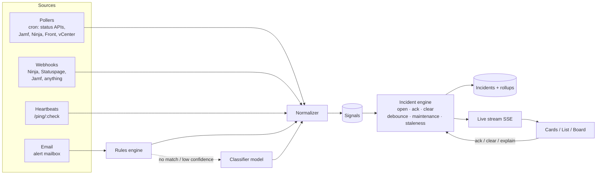

# IT Mission Control: design

A quick-look status board for everything IT depends on. It shows the **current state** of
each service, how long it has been in that state, and a compressed history, and it links
straight to the source for detail.

It fixes a specific problem. Alerts land in Slack and Front as one-off snapshots. You
can't tell what is still broken, or when something cleared, without lining up "FAILED"
and "RESOLVED" messages yourself. Mission Control keeps that state for you: it opens a
thing on alert, keeps it lit, and closes it when the clear arrives.

Prototype: [`prototype/index.html`](../prototype/index.html) (open it in a browser; it uses
simulated data and a scripted demo feed).

---

## 1. Design principles

Taken from game HUDs, watch complications, mixing desks, and the classic Windows Task
Manager ("TMOG"):

1. **Every pixel has a job.** A card shows five things and nothing else: brand icon, name,
   current state (the border), time in state, and history. Everything else lives one click
   away in the side panel.
2. **Healthy is quiet, trouble is loud.** Green borders are dimmed so a wall of healthy
   services recedes. Only off-nominal states use full color, glow or motion. On a TV, motion
   is reserved for DOWN so the eye goes straight to it.
3. **The border is the state; the strip is the past.** The outline of a card (or the name
   pill in list view) is always the *current* state. The history strip never decides the
   border color.
4. **Peak and hold, like a clip LED.** When a check goes red, the border flashes, then stays
   red until it clears. After it clears, a fading **PEAK** tag and corner notch stay for
   30 minutes. Someone glancing at the TV can tell that something just happened, even if
   it has already recovered.
5. **Attack and release.** As on an audio compressor, entering a bad state is fast and
   leaving it is deliberate. A check needs N consecutive good readings to clear, which
   stops a flapping check from strobing the board.
6. **State is never color alone.** Each state has a glyph (◆ ▲ ○ ■ ◇ ●) and a word, so the
   board stays readable for colorblind viewers and on washed-out TVs.
7. **Springboard, not a destination.** The side panel always leads with "Open source ↗".
   Mission Control tells you *where to look*; the vendor, Jamf, Ninja or Front is where you
   act.

## 2. States

| State | Color | Glyph | Meaning | Enters when | Leaves when |
|---|---|---|---|---|---|
| **DOWN** | red | ◆ | Hard failure or major outage | Source reports major/critical, a job fails, or heartbeats are missed past the hard limit | A clear signal, then the release window passes |
| **DEGRADED** | yellow | ▲ | Partial outage, threshold breach, alerting | Minor incident, metric over threshold | Same as above |
| **ACKNOWLEDGED** | orange | ■ | A person has seen it and it is still not fixed | Someone acknowledges a DOWN, DEGRADED or NO SIGNAL | The underlying signal clears |
| **NO SIGNAL** | grey, dashed | ○ | We don't know. Data is stale or the source is unreachable | No poll, ping or mail inside the expected interval × grace | Any fresh signal |
| **MAINTENANCE** | blue | ◇ | Expected downtime | A maintenance window is active (vendor-scheduled or ours) | Window ends |
| **OPERATIONAL** | green (dim) | ● | All good | A clear signal | — |

Rules:

- **Severity order** (sorting and history aggregation): DOWN > DEGRADED > NO SIGNAL > ACK > MAINT > OK.
- **Acks belong to the incident, not the check.** If an acknowledged check gets a *new*
  incident, or the acknowledged one gets worse (DEGRADED to DOWN), it re-arms and flashes
  again. The same applies to a clip light that has been reset.
- **Unexpected statuses** (a value the adapter doesn't recognize, or a classifier result
  below the confidence threshold) show as ACKNOWLEDGED-orange with a "needs review" tag. That
  keeps them visible without claiming an outage.
- **Explained history turns blue.** After an outage, someone (or the vendor's postmortem
  feed) can mark the incident as explained or planned. Its history cells repaint blue. The
  border is unaffected because that outage is over.

## 3. The compressed-time history strip

Task Manager's scrolling graph, folded so the recent past gets the most room. The strip is
cut into four zones. Each zone holds more time per cell than the one to its right:

```
|  4w → 7d   |   7d → 24h   |   24h → 1h    |      last hour       | now
|  3 × week  |   6 × day    |  23 × hour    | 30 × 2 min (cards)   |
|            |              |               | 60 × 1 min (list)    |
```

- **Cell color** is the worst state in that bucket (severity order above, with explained
  incidents counted as MAINT).
- **Cell brightness** is the share of the bucket that was affected. A 10-minute blip in a
  one-week cell is a dim sliver; a day-long outage is fully lit. Coarse buckets stay honest
  this way, because a single bad minute doesn't paint a whole week red.
- Healthy cells are drawn at ~20% green, so trouble stands out.
- "Not yet monitored" is drawn as empty track, which is different from healthy.
- Hovering a cell shows its time range, state and share affected.

Storage follows the same shape: raw signals are kept for 48h, then rolled into hourly
buckets for 30 days, then daily buckets for a year. That makes the strip cheap to render
for 100+ checks.

## 4. Views

| View | For | Notes |
|---|---|---|
| **Cards** | Desk use | Grouped by Public SaaS / Our platforms / Infrastructure. With **Auto-focus** on, anything needing attention rises into a "Needs attention" section, followed by "Planned". Healthy groups sort recently-recovered first, so PEAK tags stay near the top. |
| **List** | Density, triage | One row per check. The status color sits on the name pill. Wider history (1-minute cells for the last hour). On narrow screens, rows stack. |
| **Board** | TV / NOC wall | No controls to fiddle with. Attention items are big; healthy checks collapse to small tiles with a mini history. A "recent changes" ticker along the bottom answers "did that clear?" ("14:02 Slack ● OK after 9m"). Requests a screen wake lock; `F` toggles fullscreen. |
| **Side panel** | Click any card or row | Current state, **Open source ↗**, acknowledge or clear, signal facts (source, interval, last heard), a full-width history strip, and the raw signal log. |

**Header master meter:** one LED segment per check, sorted by severity, plus counts per
state. It works like the master bus on a mixing desk: the whole estate in one glance,
readable from across the room.

**Auto-focus (stage 2):** the prototype already reorders by severity, then by recency, and
animates the moves so they read as movement rather than a jump. The production version adds:

- A **reorder cooldown** on the TV (e.g. at most once every 30s) so the layout doesn't
  churn.
- **Pins** for checks that should always hold their position.
- Weighting by **business impact** (e.g. Okta DOWN outranks a GitHub DEGRADED).

**TV hygiene:** a dark ground, a dimmed healthy state and a slow pixel shift protect
OLED/plasma panels from burn-in. Minimum type size is set for reading at about 3 m.

## 5. Architecture



### Core model

- **Check**: something that has a state. `id, name, group, icon, source_url, adapter,
  expected_interval, grace, release_count, impact`.
- **Signal**: an immutable observation. `check_id, observed_at, state, summary,
  correlation_key, origin, raw, confidence`.
- **Incident**: an open-to-closed span for one `(check_id, correlation_key)`. It records
  open, worst, ack (who, note), clear (by signal or by hand) and explanation. **Current
  check state = the worst open incident**, overridden by an active maintenance window, or
  NO SIGNAL when stale.
- **Maintenance window**: from vendor feeds (Statuspage "scheduled" incidents, M365 planned
  maintenance) or entered by us.

A check can have several open incidents at once. NinjaOne might report "disk 92%" and
"service stopped" on FS01; the card shows the worst, and the panel lists both.

### Ingest adapters

| Kind | Examples | Notes |
|---|---|---|
| **Poll** | Statuspage-hosted status pages (Zoom, GitHub, Atlassian and many others expose `/api/v2/summary.json`), Slack's status API, Microsoft Graph service health (`admin/serviceAnnouncement/healthOverviews` and `/issues`, needs `ServiceHealth.Read.All`), Google Workspace status JSON, Jamf Pro (`/healthCheck.html` plus API checks), NinjaOne API (device and alert state), Front API (queue snapshot: open count, past-SLA count, oldest), vCenter REST (hosts, triggered alarms) | Each adapter maps vendor states onto our six. Cadence is per check. **Endpoints to be confirmed against each vendor's current docs during build.** |
| **Webhook** | NinjaOne alert webhooks, Statuspage subscriptions, Jamf webhooks, generic JSON | `POST /api/ingest/:source` with a per-source secret or HMAC. A generic schema lets anything that can send JSON report state. |
| **Heartbeat** | Cron jobs, backup scripts, Linux and Windows boxes | `GET/POST /api/ping/:check/:token` (and `/fail`). A missed ping moves the check to NO SIGNAL, then to DOWN past a hard limit. Same idea as healthchecks.io. |
| **Email** | Veeam, UPS, vendor notices, anything that only emails | An alert mailbox (an M365 shared mailbox read through Graph, or forwarding into an inbound-mail endpoint). See below. |

For Windows and Linux servers, the plan is to **lean on NinjaOne** (it already watches them)
rather than run a second agent. Heartbeats cover the gaps (cron jobs, appliances, things
Ninja can't see).

### Email: open on alert, close on follow-up

1. **Parse**: sender, subject, body, thread headers (`Message-ID`, `In-Reply-To`,
   `References`).
2. **Tier 0, deterministic rules** (most mail): sender and subject patterns map to
   `check`, `state` and `correlation_key`, plus whether the mail *opens* or *clears*. For
   example:
   `from:veeam@ subject:/\[(Failed|Warning|Success)\] (?<job>.+?) / → check=veeam-{job}, key={job}, Success ⇒ clear`.
   Thread headers and normalized subjects (with `RE:`, `[RESOLVED]` and similar stripped)
   tie a resolution to the alert it closes.
3. **Tier 1, classifier model** (anything rules don't match): a small, fast model reads the
   mail and returns structured JSON:
   `{check_id | "unknown", state, correlation_key, opens|clears, confidence, one_line_summary}`.
   - Confidence at or above the threshold: it acts, and the log shows
     `classified by model (0.91)`.
   - Below the threshold, or an unknown check: an orange **needs review** item holding the
     raw mail. Confirming it offers to **save a rule**, so repeat mail moves down to Tier 0
     over time.
   - The model can only map to existing checks. It never creates checks, and it never
     clears an incident a human acknowledged without a matching key.
4. Every action keeps a link back to the original message.

The same pipeline can read Slack alert channels (Events API) where an alert *only* exists
in Slack.

### Stack (proposal, open to change)

- **TypeScript end to end.** A small Node service (Fastify) for ingest, the incident
  engine, the API and SSE, with a scheduler for pollers.
- **SQLite** to start (one file, easy backups), with a clean path to Postgres.
- **Front end**: a light framework (Svelte or Preact) built from the prototype's design
  tokens. Live updates over Server-Sent Events.
- **Deploy**: a single Docker container on an internal VM, behind SSO (Entra ID / Okta
  OIDC). The TV board uses a read-only kiosk token.
- **Config as code**: checks, rules and thresholds in a versioned YAML file, editable from
  the UI later.

## 6. Roadmap

| Phase | Scope |
|---|---|
| **0. Prototype** (this commit) | Visual language, states, history strip, three views, side panel, demo feed |
| **1. Core + public SaaS** | Data model, incident engine (debounce, staleness, maintenance), SSE, pollers for Slack, Zoom, M365, Okta, Google and GitHub, Board view on a real TV |
| **2. Our platforms** | Jamf, NinjaOne (API and webhook), Front snapshots, vCenter, heartbeats |
| **3. Email** | Alert mailbox, Tier 0 rules, open and close on follow-up, needs-review queue |
| **4. Smarts** | Tier 1 classifier, rule suggestions, auto-focus cooldown and pins, impact weighting |
| **5. User side** (stretch) | Per-user views and filters, ack notes and handoff, notifications that link to the card instead of repeating the alert |

## 7. Open questions

1. **Classifier model.** I read "Jev/Laya style type 1 model" as a small, fast,
   "System 1" style classifier. Is that right? And can alert email contents go to a hosted
   model (e.g. a small Claude model over the API), or must it run locally?
2. **NO SIGNAL.** Keep it as its own grey dashed state (as prototyped), or fold it into
   orange as an "unexpected status"?
3. **Ack behaviour.** Who can acknowledge? Should an acknowledgement expire (e.g. back to
   red after 8h, or at shift change)?
4. **Email source.** Alert mail already lands in Front. Should Mission Control read those
   Front inboxes through the API, or get its own mailbox (M365 shared mailbox through Graph)?
5. **Servers.** Does NinjaOne already cover the Windows and Linux servers (and VMware
   hosts) well enough to be the source of truth, or do we need direct checks too?
6. **Scale and hosting.** Roughly how many checks: 20, 100, 500? (Past ~60, the board
   needs group roll-ups.) Where should it run (internal VM, Azure, other), and which SSO
   provider?
7. **TV.** What screen and resolution? Should a new DOWN play a sound?
